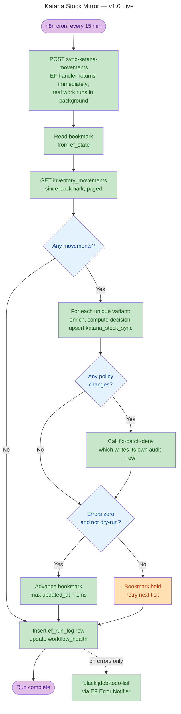

# Katana Stock Mirror — Specification v1.0

**Status:** Live (deployed 29 April 2026)
**Owner:** JdeB
**Last verified:** 29 April 2026

---

## 1. Plain-English Specification

### What this process does

The Katana Stock Mirror keeps the `katana_stock_sync` table in Supabase within roughly fifteen minutes of Katana's true stock state for every SKU at the Grove Cross location, and keeps Shopify's "continue when out of stock" / "deny when out of stock" inventory policy in line with that state.

Every fifteen minutes an n8n schedule fires the `sync-katana-movements` Edge Function. The Edge Function asks Katana for every stock movement (sales, production, manual adjustment, BOM swap, anything that changes a stock figure) since the last successful run, processes only the variants that actually moved, and writes their refreshed stock components back to Supabase. Where a movement has changed the answer to "should this SKU be sellable on Shopify?", the Edge Function calls the existing `fix-batch-deny` function to flip the Shopify policy.

### Why this process exists

Three motivations:

The first is to stop overselling. If a SKU runs out of stock in Katana, Shopify needs to be told to stop accepting orders for it. Conversely, when a SKU comes back into stock, Shopify needs to be told to resume selling it. Stock policy in Shopify must reflect stock reality in Katana, with a small, predictable delay.

The second is to give every other stock-consuming process in the business a single, fast, reliable place to read stock data — namely, `katana_stock_sync` in Supabase. Without this mirror, every process that needs stock figures has to call Katana directly, which means each one has to manage Katana's pagination, rate limits, and idiosyncrasies. With the mirror in place, those processes do a simple Supabase read instead.

The third is efficiency. The previous approach (`reconcile-three-stage`) read the entire 2,200-row stock table from Katana every four hours to find the few dozen SKUs that had actually changed. Polling movements instead of full state reduces the API load by roughly 50× and shortens the worst-case detection lag from four hours to fifteen minutes.

### What this process does not do

It does not write to Katana. Katana remains the source of truth for what's in stock; Supabase mirrors that truth, never the other way round.

It does not track movements at locations other than Grove Cross.

It does not (yet) replace the existing webhook handler (`sync-inventory-policy`) or the four-hourly reconciler (`reconcile-three-stage`). Both legacy systems continue to run in parallel. Retiring them is a separate decision, dependent on a period of observation showing that the new process agrees with them on every SKU.

It does not write its own audit row when it changes a Shopify policy — `fix-batch-deny` already does that.

### Who depends on this process

- Stock-consuming processes (current and future) that read `katana_stock_sync` from Supabase rather than calling Katana directly.
- The dashboard's stock views.
- The EF Watchdog, which watches `workflow_health.last_success_at` for this EF and alerts if no successful run has happened within the expected interval (15 minutes).
- Customers, indirectly — they get a Shopify experience that reflects warehouse reality with at most fifteen minutes of lag.

### Failure behaviour, in plain English

If anything goes wrong during a run — Katana times out, a single variant's enrichment fails, the Edge Function gets killed by the runtime — the bookmark stays where it was and the next run picks up from the same point. Every side effect (stock-component write, fix-batch-deny call) is idempotent; reprocessing a variant produces the same result as processing it once. Errors are reported in two ways. Per-run failures post a Slack message to `#jdeb-todo-list` immediately via a generic Postgres trigger on the `ef_run_log` table — described in §3.9. If the schedule itself stops firing (so even the run log stops being written), the EF Watchdog detects the resulting staleness in `workflow_health` and surfaces it on the dashboard.

A dry-run mode is available for testing: posting `{"dry_run": true}` to the EF runs everything except the Shopify policy update and the bookmark advance. Useful for verifying behaviour without changing customer-facing state.

---

## 2. Flowchart



---

## 3. Technical Specification

### 3.1 Components

| Component | Identifier | Type | Notes |
|---|---|---|---|
| Schedule trigger workflow | `iT3dXSazWHbw6d9v` | n8n workflow | "Katana Movements Sync — Every 15 Minutes" |
| Polling Edge Function | `sync-katana-movements` v3 | Supabase EF | EdgeRuntime.waitUntil pattern, Pro-tier project |
| Shopify policy writer | `fix-batch-deny` v8 | Supabase EF | Pre-existing; writes its own audit rows |
| Bookmark store | `ef_state` | Postgres table | Generic per-EF state; one row per EF slug |
| Run log | `ef_run_log` | Postgres table | One row per run; jsonb stats + decisions |
| Stock mirror | `katana_stock_sync` | Postgres table | The mirror itself; PK = sku |
| Product registry | `katana_products` | Postgres table | Used for voucher exclusion (read-only here) |
| Seasonal policy | `seasonal_selling_policy` | Postgres table | Used for in-season / cooling-off logic (read-only here) |
| Health table | `workflow_health` | Postgres table | EF Watchdog reads this |
| Audit log | `inventory_policy_audit` | Postgres table | Written by `fix-batch-deny`, NOT by this EF |
| Error notifier workflow | `iJORZdujwRbKlNoa` | n8n workflow | "EF Error Notifier" — webhook trigger to Slack |
| Webhook URL secret | `ef_error_notifier_webhook_url` | Supabase Vault secret | n8n webhook URL routing error notifications |
| Error notification trigger | `trg_ef_run_log_notify_errors` | Postgres trigger | Generic across all EFs writing to `ef_run_log` |

### 3.2 Schedule

Cron expression `*/15 * * * *` — every 15 minutes UTC. Fires at :00, :15, :30, :45 of every hour, every day.

### 3.3 Edge Function entry point

`POST https://cuposlohqvhikyulhrsx.supabase.co/functions/v1/sync-katana-movements`

Headers: `Content-Type: application/json`, `Authorization: Bearer <anon-key>` (anon key is sufficient because `verify_jwt: false` on the function; the function runs with service-role privileges internally via `Deno.env.get("SUPABASE_SERVICE_ROLE_KEY")`).

Request body: optional `{"dry_run": true}`. Empty body or omitted body defaults to `dry_run: false`.

Response: returns within ~1 second with `{status: "accepted", run_id, dry_run, started_at}`. The real work runs in the background via `EdgeRuntime.waitUntil`. The Pro-tier wall-clock budget for the background runner is 400 seconds.

### 3.4 Behaviour, in detail

**Stage 1 — Bookmark read.** The EF reads the row in `ef_state` keyed on `ef_slug = 'sync-katana-movements'` and uses its `bookmark_value` as the starting timestamp. If no row exists (cold start), the bookmark defaults to `now() − 1 hour`.

**Stage 2 — Movement polling.** The EF calls `GET https://api.katanamrp.com/v1/inventory_movements?location_id=162781&updated_at_min=<bookmark>&limit=250&page=N`, paging from page 1 until a page returns fewer than 250 rows. Pacing: 2.5 seconds between page calls. Rate-limit handling: on 429, retry up to 3 attempts with exponential backoff (5s × 2^(n-1)).

**Stage 3 — Sort, dedup, soft cap.** Katana returns movements in DESCENDING `updated_at` order; the EF sorts them ASCENDING after collection (so failures don't skip earlier movements). It then deduplicates by `variant_id`, keeping the most recent movement per variant. If more than 100 unique variants are pending, the soft cap engages: the EF processes the OLDEST 100 to make forward progress; the remainder is picked up on the next run; the bookmark advances only to the cap boundary; the response carries `more_pending: true`.

**Stage 4 — Per-variant enrichment.** For each unique variant, the EF makes two Katana calls: `GET /inventory?variant_id=X` (to get the Grove Cross row's quantity_in_stock, quantity_committed, quantity_expected, safety_stock_level) and `GET /variants/{id}` (to get the SKU). Pacing: 1 second between every Katana call. Skips: no Grove Cross row, SKU without hyphen, or `katana_products.product_type = 'voucher'`.

**Stage 5 — Decision tree.** Ported verbatim from `sync-inventory-policy` v15 including the v10 `manual_override` short-circuit:

```
effective_stock = in_stock + expected − committed − safety
stock_based_policy = (effective_stock > 0 AND expected > 0) ? CONTINUE : DENY

if seasonal policy exists:
    if in selling window:
        target = stock_based_policy
    else if presale start month set:
        if presale not yet open: target = DENY
        else: target = (presale_allowed ? CONTINUE : DENY)
    else:
        target = (presale_allowed ? CONTINUE : DENY)
else:
    target = stock_based_policy

if manual_override in (CONTINUE, DENY):
    target = manual_override   # overrides everything above
```

**Stage 6 — Stock-component upsert.** The EF upserts `katana_stock_sync` for every successfully-enriched variant with the four stock components and a fresh `last_checked_at`. The `shopify_inventory_policy` column is NOT written here; that column is owned by `fix-batch-deny`.

**Stage 7 — Shopify policy update.** For each variant where the computed target ≠ the current `shopify_inventory_policy`, the EF calls `fix-batch-deny` in batches of 50 SKUs, with 2s pacing between batches. Body: `{skus, target_policy, reason}`. `fix-batch-deny` writes its own row to `inventory_policy_audit` for every SKU it changes.

**Stage 8 — Bookmark advance.** New bookmark = `max(updated_at) + 1 millisecond`. The +1ms is necessary because Katana's `updated_at_min` is INCLUSIVE — without it, the boundary movement would be reprocessed every tick. The bookmark is advanced only when `errors.length === 0` and `dry_run === false`. On any error or in dry-run, the bookmark stays put and the next run reprocesses idempotently.

**Stage 9 — Run log.** A row is inserted into `ef_run_log` with `run_id`, `ef_slug`, `dry_run`, `started_at`, `completed_at`, `status`, `exit_reason`, `stats` (jsonb), `decisions` (jsonb, first 50), `errors` (text[]), `log` (text[]). Performed in a `finally` block so it lands on errors as well as on clean completion.

**Stage 10 — Health update.** Upserts `workflow_health` keyed on `workflow_id = 'sync-katana-movements'` with `last_success_at` (clean run) or `last_error_at` + `last_error_message` (run with errors). `expected_interval_minutes = 15`.

### 3.5 Performance envelope

Per-variant work: ~3 seconds (1s pacing × 2 Katana calls + ~1s API latency).
Soft cap of 100 unique variants × 3s = ~300s, comfortably inside the Pro-tier 400s wall-clock budget.

Verified live 29 April 2026:
- Cold-start canary (4 variants): 15 seconds
- Soft-cap test (300+ variants in window, 100 processed): 284 seconds
- First production run (18 variants): 47 seconds; agreed with existing systems on all 18 SKUs

### 3.6 Idempotence

Every side effect is safe to repeat:
- Stock-component upsert: converges on the same numbers from any starting point
- `fix-batch-deny` call: has its own `already_correct` guard and skips no-op changes
- Bookmark advance: only happens on clean runs; failed runs reprocess from the same point
- `ef_run_log` insert: a new run produces a new `run_id`, no collision possible
- `workflow_health` upsert: a single row per EF, latest write wins

### 3.7 Out-of-scope

- Locations other than Grove Cross
- Writes back to Katana
- Stock for products without a hyphenated SKU (legacy data carries this constraint forward from existing systems)
- Vouchers (excluded by product_type)
- Replacing the legacy webhook (`sync-inventory-policy`) or four-hourly reconciler (`reconcile-three-stage`) — both run in parallel until retirement is approved separately

### 3.8 Source code

EF source: `supabase/functions/sync-katana-movements/index.ts` in the `JdeBosdari901/cosmo` GitHub repo.

n8n workflow: `iT3dXSazWHbw6d9v` (Katana Movements Sync — Every 15 Minutes).

---

### 3.9 Error reporting

The Katana Stock Mirror has two layers of operational alerting:

**Layer 1 — Per-run errors (real-time).** Every run inserts a row to `ef_run_log` in its `finally{}` block, including runs that complete with errors. A Postgres `AFTER INSERT` trigger on `ef_run_log` (`trg_ef_run_log_notify_errors`) inspects each new row. When the row's `errors[]` array is non-empty or `stats->>'fix_errors' > 0`, the trigger reads the n8n webhook URL from Supabase Vault (secret name `ef_error_notifier_webhook_url`) and calls `pg_net.http_post` to it. The webhook fires the `EF Error Notifier` n8n workflow (`iJORZdujwRbKlNoa`), which posts a formatted message to the `#jdeb-todo-list` Slack channel via the existing Slack OAuth2 credential (`HDeReRHRjNm3NaZ7`, shared with the `Cosmo Workflow Error Handler`).

The trigger function is generic across EFs. Every EF that adopts the `ef_run_log` pattern inherits this notification path automatically — no additional code in the EF, no per-EF wiring. Routing is centralised in two places: change the Slack channel by editing the n8n workflow; change the destination entirely (different webhook, different platform) by updating the vault secret.

Failure of the notification path does not block the underlying `ef_run_log` INSERT. If the vault secret is missing, the trigger emits a `WARNING` and returns cleanly. If `pg_net.http_post` itself fails, the request is logged in `net._http_response` for diagnostic inspection but the trigger does not retry; the `ef_run_log` row remains the canonical record of the run.

Dry-runs that complete with errors ARE notified, marked `(DRY RUN)` in the Slack message so they're distinguishable from real failures. Successful dry-runs (zero errors) are quiet.

**Layer 2 — Stale schedule (latent).** If the n8n schedule fails to fire altogether — workflow disabled, n8n service down, or every run errors so catastrophically that the `ef_run_log` insert itself doesn't happen — `workflow_health.last_success_at` for this EF goes stale. The EF Watchdog (separate scheduled process) detects staleness against `expected_interval_minutes = 15` and surfaces it on the dashboard's "Process & Sync Health" card. This is the catch-all when Layer 1 itself is broken.

**Implementation references**

| Component | Identifier |
|---|---|
| Trigger function | `public.fn_notify_ef_run_log_errors()` |
| Trigger | `trg_ef_run_log_notify_errors ON public.ef_run_log` |
| Vault secret | `ef_error_notifier_webhook_url` (id `72fde3b6-a281-45de-8385-6880574110d0`) |
| n8n notifier workflow | `iJORZdujwRbKlNoa` (EF Error Notifier) |
| Slack credential | `HDeReRHRjNm3NaZ7` (Slack OAuth2 API) |
| Slack channel | `C0AQHBN15SS` (`#jdeb-todo-list`) |

---

## 4. Revision Log

| Version | Date | Author | Change |
|---|---|---|---|
| 1.0 | 29 April 2026 | Claude (via JdeB) | Initial spec covering EF v3 + n8n workflow at deployment |
